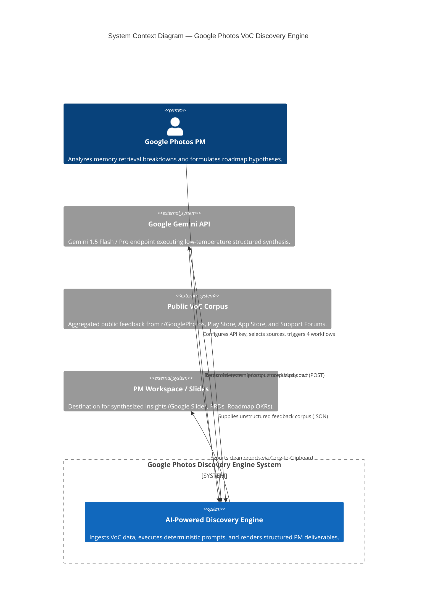
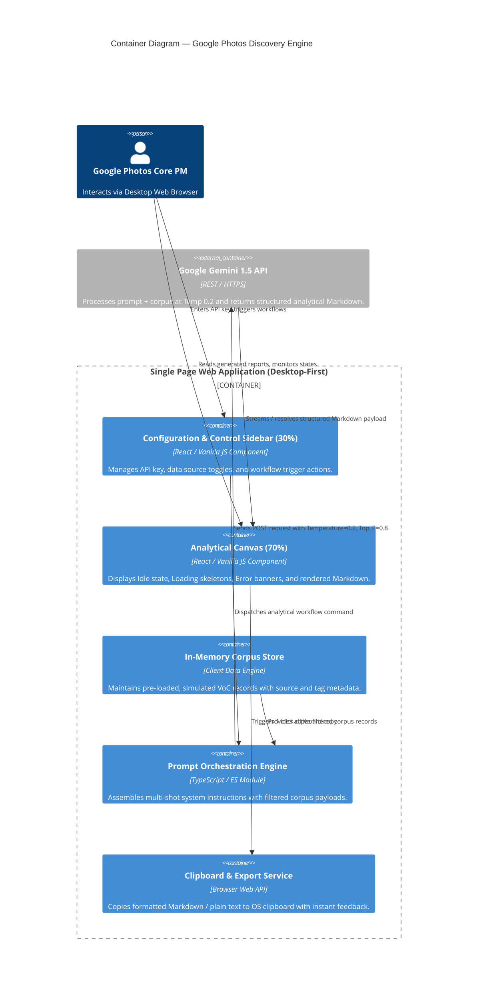
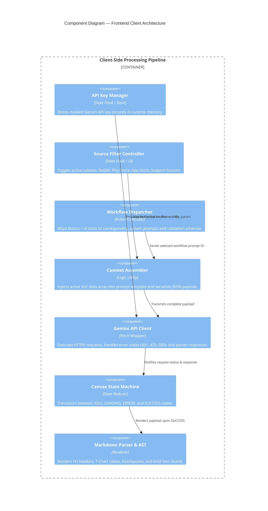
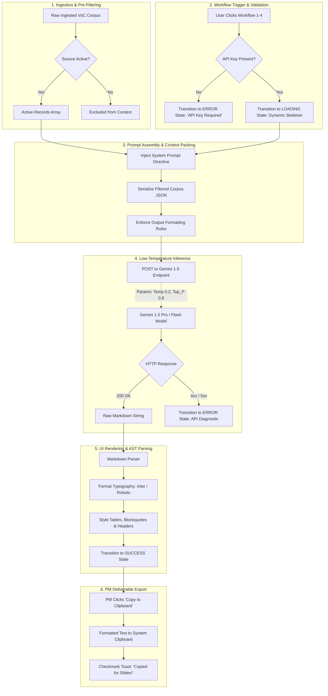
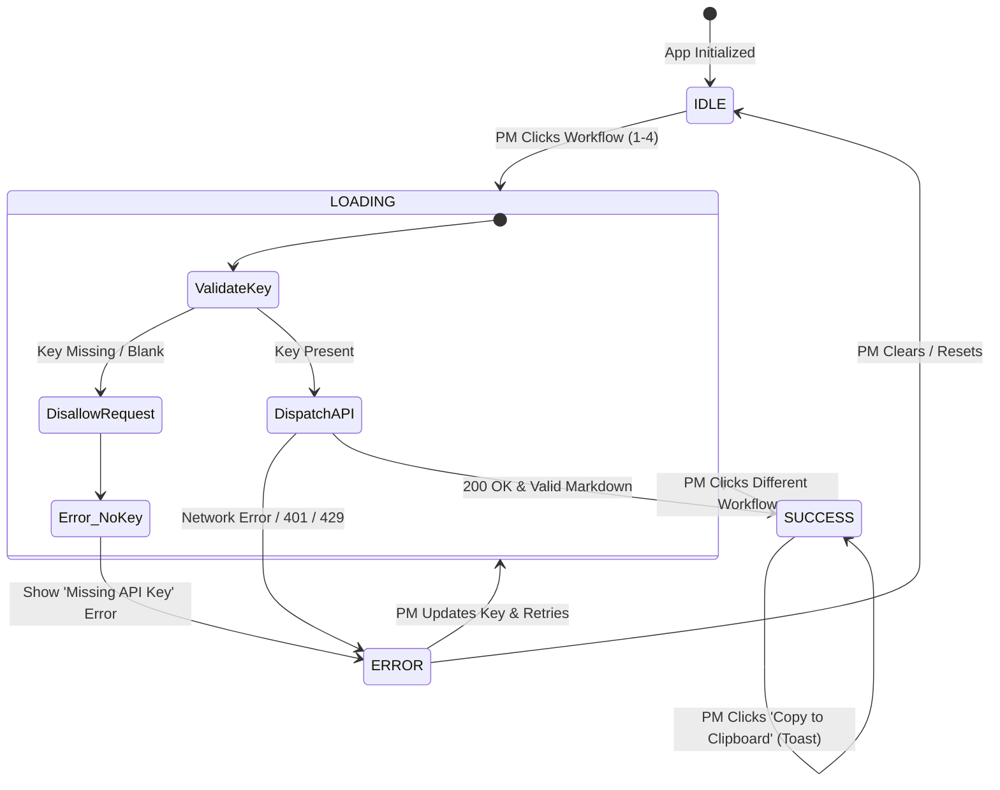
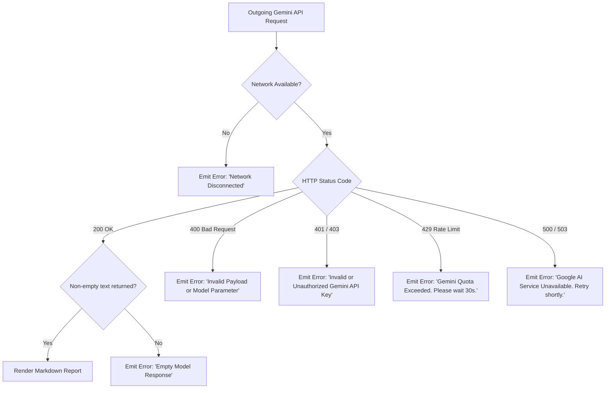

# Technical Architecture Document: AI-Powered Discovery Engine for Google Photos

**Project Title:** AI-Powered Discovery Engine for Google Photos (Internal PM Tool)  
**Target Organization:** Google LLC — Geo & Personal Search / Google Photos (`com.google.android.apps.photos`)  
**Target Users:** Google Photos Core Experience & Semantic Search Product Managers (PMs)  
**Domain:** Computational Photography, Semantic Image Retrieval & Personal Knowledge Management (PKM)  
**Document Version:** 1.0.0  
**Status:** Approved Architecture Baseline  

---

## 1. Executive Summary & Architectural Principles

The **AI-Powered Discovery Engine for Google Photos** is a desktop-first, internal analytical intelligence platform engineered specifically for Google Photos Core Experience Product Managers. Its primary objective is to ingest, normalize, and synthesize multi-channel, unstructured Voice-of-Customer (VoC) feedback (Reddit `r/GooglePhotos`, Google Play Store, Apple App Store, Google Support Forums) to uncover the **behavioral and cognitive heuristics of human memory retrieval failures**.

Rather than relying on superficial sentiment scores, the platform operates as a **deterministic, structured RAG (Retrieval-Augmented Generation) pipeline** to expose the **Semantic-Episodic Gap**: the friction created when human episodic recall (ambient weather, wardrobe accents, emotional states, relative chronology) collides with rigid computer vision indexing tags (exact dates, GPS coordinates, literal object bounding boxes).

```
+---------------------------------------------------------------------------------------------------------+
|                                    CORE ARCHITECTURAL PRINCIPLES                                        |
+------------------------------------+--------------------------------------------------------------------+
| 1. Deterministic Non-Chatbot UX    | Zero open-ended chat prompts. Replaced by 4 standardized analytical|
|                                    | workflow triggers generating consultant-grade, structured reports. |
| 2. Strict LLM Parameter Envelopes  | Gemini 1.5 Pro/Flash bound to Temperature: 0.2 & Top_P: 0.8 for    |
|                                    | reproducible, hallucination-free, corpus-grounded outputs.         |
| 3. High-Fidelity Internal Tooling  | Clean Google Material Design aesthetic (Inter/Roboto, 30/70 split)  |
|                                    | with robust UI state transitions (Idle, Loading, Error, Success).  |
| 4. Zero-Trust API Key Governance   | Client-side session memory storage with zero external logging and  |
|                                    | masked input controls.                                             |
+------------------------------------+--------------------------------------------------------------------+
```

---

## 2. C4 Architectural Model

### 2.1 Level 1: System Context Diagram

The System Context diagram illustrates how the Discovery Engine fits into the broader operational ecosystem of a Google Photos Core PM.



---

### 2.2 Level 2: Container Diagram

The Container diagram decomposes the system into its primary runtime containers and data boundaries.



---

### 2.3 Level 3: Component Diagram (Frontend Application Architecture)



---

## 3. End-to-End Data Flow & Pipeline Architecture

The execution lifecycle transitions sequentially through 6 deterministic stages:



---

## 4. The 4 Analytical Workflows & Prompt Contracts

To guarantee deterministic, non-chat outputs, the engine encapsulates 4 discrete prompt contracts. Each contract binds the LLM to a specific persona, analytical methodology, and strict syntax specification.

### 4.1 Specification Matrix

| Workflow ID | Workflow Title | Analytical Objective | Output Syntax Contract | Temperature / Top_P |
|---|---|---|---|---|
| **WF-1** | **Taxonomy of "Lost" Photos** | Categorize high-friction edge-cases (incidental screenshots, vibe photos) | Strict Markdown: `### [Category]`, `- [Bullet Definition]`, `> [Direct Verbatim Quote]` | `0.2` / `0.8` |
| **WF-2** | **Cognitive Gap Matrix** | Deconstruct human episodic recall vs. rigid metadata demands | Markdown T-Chart Table: `Retained Episodic Anchors` vs `Forgotten System Demands` vs `Failure Mode` | `0.2` / `0.8` |
| **WF-3** | **Behavioral Workaround Mapping** | Document manual brute-forcing actions & score friction | Numbered List: `1. **[Name]**`, `Friction Score: [High/Med/Low]`, Definition | `0.2` / `0.8` |
| **WF-4** | **Product Opportunity Synthesis** | Translate user pain into actionable roadmap POAs | Structured Sections: `## POA [N]: [Title]`, `### Problem Space`, `### Proposed AI Solution`, `### Hypothesis to Test` + `## Comparison / Trade-off Matrix` Table | `0.2` / `0.8` |

---

### 4.2 Multi-Shot Prompt Directives & Contracts

#### Workflow 1 Prompt Contract: Taxonomy of "Lost" Photos
```text
SYSTEM INSTRUCTION:
Act as a Principal Product Manager for Google Photos Core Search. Analyze the provided VoC feedback dataset.
Identify exactly 3 distinct categories of personal photos that users struggle to retrieve using conventional keyword search.
EXCLUDE generic categories (e.g., 'vacations', 'birthdays', 'pets').
FOCUS strictly on edge-cases such as 'Incidental Screenshots', 'Situational/Aesthetic Vibe Photos', or 'Relative-Temporal Events'.

OUTPUT CONTRACT:
- Use strictly Markdown formatting.
- For each category, use H3 (###) for the category name.
- Use bullet points (-) for the formal analytical definition.
- Use Blockquotes (>) for the exact verbatim quote from the provided data as empirical evidence.
- Do NOT include conversational opening or closing statements. Output only the structured analysis.
```

#### Workflow 2 Prompt Contract: Cognitive Gap Matrix
```text
SYSTEM INSTRUCTION:
Act as a Principal Cognitive UX Researcher for Google Photos. Analyze the provided VoC feedback dataset to map the cognitive gap during failed photo searches.
Deconstruct what sensory, relational, emotional, or episodic anchors users consistently retain in working memory (e.g., weather, apparel color, companion, ambient setting) versus what rigid absolute metadata the current system demands (e.g., exact calendar dates, GPS coordinates, literal object labels).

OUTPUT CONTRACT:
- Output strictly a Markdown Table (T-Chart) with exactly 3 columns:
  | Retained Episodic Anchors (Human Recall) | Forgotten System Demands (Current Index Requirements) | Failure Mode / Search Breakdown |
- Ground every row directly in user behaviors demonstrated in the dataset.
- Do NOT include introductory text, conversational chatter, or concluding remarks.
```

#### Workflow 3 Prompt Contract: Behavioral Workaround Mapping
```text
SYSTEM INSTRUCTION:
Act as a Staff Product Manager for Google Photos. Analyze the provided VoC dataset to identify the specific manual compensatory actions and brute-force workarounds users endure when search fails.
Name each distinct behavioral pattern with high-impact product terminology (e.g., 'The Person Pivot', 'Chronological Scrubbing', 'External App Trail', 'Multi-Keyword Permutation Roulette').
Assign an analytical 'Friction Score' (High, Medium, or Low) based on the cognitive tax, time loss, and frustration expressed.

OUTPUT CONTRACT:
- Format as a numbered list (1., 2., 3., 4.).
- Bold the name of each workaround.
- Explicitly state the friction score on the next line: "- **Friction Score**: High / Medium / Low".
- Provide a detailed definition explaining the exact sequence of user actions and cognitive friction.
- Output ONLY the numbered list.
```

#### Workflow 4 Prompt Contract: Product Opportunity Synthesis & Trade-off Matrix
```text
SYSTEM INSTRUCTION:
Act as VP of Product for Google Photos. Based strictly on the identified search failure taxonomies, cognitive gaps, and manual workarounds extracted from the VoC dataset, synthesize exactly 2 high-impact Product Opportunity Areas (POAs).
After detailing both POAs, generate a "Comparison / Trade-off Matrix" comparing POA 1 vs POA 2 based on: (1) Specific Retrieval Problems Solved, (2) User Impact, and (3) Implementation Effort.

OUTPUT CONTRACT:
- Use Markdown formatting with H2 (##) for each POA title.
- Under each POA, include exactly three sub-headers using H3 (###):
  ### Problem Space
  ### Proposed AI Solution
  ### Hypothesis to Test
- Formulate the hypothesis using a rigorous PM structure: "If [Proposed Action], then [Measurable Behavioral Outcome], resulting in [Quantifiable Impact on Metric]".
- Following POA 2, include an H2 header: "## Comparison / Trade-off Matrix".
- Render a structured Markdown Table comparing POA 1 vs POA 2 with the columns:
  | Evaluation Dimension | POA 1: [Short Title] | POA 2: [Short Title] |
  Covering rows for: Specific Retrieval Problems Solved, User Impact (High/Medium/Low + rationale), Implementation Effort (High/Medium/Low + rationale), and Strategic Recommendation.
- Output ONLY the structured POAs and Comparison Matrix.
```

---

## 5. Ingestion Engine & Data Contract

### 5.1 JSON Data Schema Definition

The ingestion engine processes an array of normalized JSON records:

```typescript
export type VoCSource = 
  | "r/GooglePhotos" 
  | "Play Store" 
  | "App Store" 
  | "Google Support Forum";

export type FeedbackType = 
  | "Reddit Post" 
  | "1-Star Review" 
  | "2-Star Review" 
  | "Support Thread" 
  | "Feature Request";

export interface UserFeedbackRecord {
  id: string;
  source: VoCSource;
  type: FeedbackType;
  content: string;
  metadata: {
    upvotes?: number;
    rating?: number;
    device?: string;
    date: string;
    tags: string[];
  };
}
```

### 5.2 Deterministic Seed Corpus (Pre-Loaded in Client)

To guarantee instantaneous, reliable offline execution without external scraper flakiness, the client pre-loads a high-signal, multi-channel simulated corpus:

```json
[
  {
    "id": "voc-001",
    "source": "r/GooglePhotos",
    "type": "Reddit Post",
    "content": "I'm trying to find a photo of a specific pasta dish from my Rome trip. Searching 'pasta' gives me screenshots of recipes. I can't remember the exact date, I just know it was raining and I was wearing a red jacket. I gave up after scrolling for 10 minutes.",
    "metadata": {
      "upvotes": 45,
      "date": "2023-11-04",
      "tags": ["search_failure", "screenshots", "travel", "episodic_weather"]
    }
  },
  {
    "id": "voc-002",
    "source": "Play Store",
    "type": "1-Star Review",
    "content": "Search is useless now. If I don't know the exact date, I can't find anything. I try searching for my dog, but it shows every dog photo instead of the specific one where he's sleeping on my messy desk.",
    "metadata": {
      "rating": 1,
      "device": "Pixel 7 Pro",
      "date": "2024-01-15",
      "tags": ["pets", "context_clutter", "posture_ambiguity"]
    }
  },
  {
    "id": "voc-003",
    "source": "Google Support Forum",
    "type": "Support Thread",
    "content": "How do I filter OUT screenshots when searching for tickets or receipts? Every time I search 'concert', I get 200 screenshots of Spotify playlists and ticket confirmations rather than the photos of me and my friends at the venue.",
    "metadata": {
      "upvotes": 112,
      "date": "2023-09-28",
      "tags": ["screenshot_pollution", "concert", "social_retrieval"]
    }
  },
  {
    "id": "voc-004",
    "source": "r/GooglePhotos",
    "type": "Reddit Post",
    "content": "Had to find a picture of my car's tire pressure sticker taken last year. Searched 'tire' and 'car' and got 500 pictures of road trips. I ended up opening WhatsApp to find the date I texted it to my mechanic, then scrolled to that date in Google Photos.",
    "metadata": {
      "upvotes": 88,
      "date": "2024-02-10",
      "tags": ["workaround", "external_app_audit", "utilitarian_doc"]
    }
  },
  {
    "id": "voc-005",
    "source": "App Store",
    "type": "2-Star Review",
    "content": "I remember the vibe of a photo—it was a sunset where everything had a purple haze on the beach in Greece. Searching 'sunset beach' returns 1,200 photos from the last 8 years. Why can't I search 'purple sunset with two people'?",
    "metadata": {
      "rating": 2,
      "device": "iPhone 15 Pro",
      "date": "2024-03-02",
      "tags": ["aesthetic_vibe", "sensory_recall", "color_query"]
    }
  },
  {
    "id": "voc-006",
    "source": "r/GooglePhotos",
    "type": "Reddit Post",
    "content": "I wanted to show my friend a meme I saved three weeks ago about cats in coffee cups. Searching 'cat' brings up thousands of actual pictures of my cat. Why does Google Photos mix saved web garbage with my real life memories?",
    "metadata": {
      "upvotes": 142,
      "date": "2024-03-18",
      "tags": ["meme_pollution", "asset_silos", "saved_media"]
    }
  },
  {
    "id": "voc-007",
    "source": "Google Support Forum",
    "type": "Support Thread",
    "content": "I cannot remember what month my nephew was born, but I know my mom was holding him while sitting in her green floral armchair. Searching 'baby' or 'chair' gives endless hits. I spent 20 minutes scrubbing the timeline year by year.",
    "metadata": {
      "upvotes": 67,
      "date": "2024-04-05",
      "tags": ["chronological_scrubbing", "relational_anchor", "furniture_context"]
    }
  }
]
```

---

## 6. Frontend Architecture & UI State Machine

### 6.1 Layout Specification (30 / 70 Desktop Grid)

The interface utilizes a rigid, responsive desktop-first layout designed to match Google's internal Cloud & Search console aesthetics:

```
+---------------------------------------------------------------------------------------------------------+
| [Google Photos Pinwheel Icon]  Google Photos Memory Retrieval Intelligence Engine   [v1.0.0 Internal PM]|
+------------------------------------+--------------------------------------------------------------------+
| LEFT SIDEBAR (30% WIDTH)           | MAIN READING CANVAS (70% WIDTH)                                    |
|                                    |                                                                    |
| 1. API KEY CONFIGURATION           | HEADER BAR:                                                        |
| [Input: Masked Password Field]     | [Workflow Title Badge]                  [Copy Markdown Button 📋]  |
| [Status Badge: Connected/Offline]  |                                                                    |
|                                    | CANVAS CONTENT SURFACE:                                            |
| 2. CORPUS SOURCE FILTER            |                                                                    |
| [x] r/GooglePhotos (Reddit)        | State A: IDLE (Empty State Illustration + Instruction)             |
| [x] Play Store (1-2 Star Reviews)  | State B: LOADING (Pulsing Skeleton Cards + Dynamic Status Text)    |
| [x] Apple App Store (Reviews)      | State C: ERROR (Dismissible Red Toast with API Troubleshooting)    |
| [x] Google Support Community       | State D: SUCCESS (Parsed Markdown with Styled Tables & Quotes)     |
|                                    |                                                                    |
| 3. WORKFLOW ACTION BUTTONS         |                                                                    |
| [Btn 1: Taxonomy of Lost Photos]   |                                                                    |
| [Btn 2: Cognitive Gap Matrix]      |                                                                    |
| [Btn 3: Behavioral Workarounds]    | FOOTER / METADATA BAR:                                             |
| [Btn 4: Product Opportunity POAs]  | Grounding Corpus: 7 Records Ingested | Model: Gemini 1.5 Flash     |
+------------------------------------+--------------------------------------------------------------------+
```

### 6.2 State Machine Specification

```typescript
export type CanvasStatus = "IDLE" | "LOADING" | "ERROR" | "SUCCESS";

export interface DashboardState {
  apiKey: string;
  activeSources: Record<VoCSource, boolean>;
  activeWorkflowId: "taxonomy" | "cognitive_gap" | "workarounds" | "poa" | null;
  status: CanvasStatus;
  loadingMessage: string;
  errorMessage: string | null;
  reportMarkdown: string;
  lastRunTimestamp: string | null;
}
```



### 6.3 State Descriptions & UX Contracts

1. **IDLE State**:
   - Displays a minimalist Google Photos pinwheel icon, an executive subtitle, and step-by-step guidance.
   - Primary instruction: *"Select an analytical workflow from the left sidebar to synthesize user search failure patterns."*
2. **LOADING State**:
   - Sidebar buttons are disabled with loading indicators to prevent concurrent duplicate requests.
   - Main canvas displays 3 animated skeleton placeholder cards (mimicking headers, tables, and blockquotes).
   - Cycles dynamic micro-copy:
     - *"Extracting behavioral retrieval heuristics..."*
     - *"Synthesizing multi-source VoC feedback..."*
     - *"Formatting structured PM deliverable..."*
3. **ERROR State**:
   - Displays a high-contrast Google Red alert banner (`#d93025` border, `#fce8e6` background).
   - Highlights explicit remediation steps (e.g., *"Invalid Gemini API Key or Rate Limit Reached. Please verify your Google AI Studio key in the sidebar."*).
4. **SUCCESS State**:
   - Smoothly transitions to formatted Markdown.
   - Headers: Styled with `Inter` / `Roboto`, dark slate font (`#202124`), proper margins.
   - Blockquotes: Styled with a left accent border (`#1a73e8` Google Blue), subtle background (`#f8f9fa`), and italicized text.
   - Tables: Full-width responsive layout with subtle borders (`#dadce0`) and alternating row striping.
   - Action: Enables the **"Copy to Clipboard"** button with a 2-second visual checkmark state.

---

## 7. Security, Privacy & API Key Governance

Because this tool is built for internal product deliberation:

1. **Memory-Only Key Lifecycle**: The user's Gemini API key is maintained strictly within the browser's runtime memory state. It is **never persisted to localStorage, cookies, session storage, or external server logs**.
2. **Masked UI Input**: The API key input is rendered as an HTML password field with a visibility toggle button.
3. **No External Proxy Logging**: API calls are routed directly from the client browser to `https://generativelanguage.googleapis.com/v1beta/models/...` via HTTPS POST. No middleman servers intercept the tokens or feedback payloads.
4. **Zero-Trust PII Scrubbing**: The pre-loaded corpus is pre-scrubbed of personal email addresses, phone numbers, and identifying handles.

---

## 8. Error Handling & Resilience Architecture



---

## 9. Architecture Validation & Acceptance Matrix

| Verification Item | Acceptance Criteria | Validation Method |
|---|---|---|
| **Deterministic UX** | Zero chat input boxes. Interaction restricted to 4 workflow triggers. | Code review & UI layout inspection |
| **LLM Grounding** | Temperature locked at `0.2`, Top_P locked at `0.8`. | API payload network inspection |
| **Workflow 1 Format** | Strict `###` category names, `-` bullet definitions, `>` blockquote quotes. | Automated Markdown AST validator |
| **Workflow 2 Format** | 3-column Markdown T-Chart Table comparing Episodic vs System demands. | Table rendering & cell count assertion |
| **Workflow 3 Format** | Numbered list with bold names and explicit `Friction Score: High/Med/Low`. | Regex pattern validation |
| **Workflow 4 Format** | Exactly 2 POAs with Problem Space, Proposed AI Solution, Hypothesis to Test + Comparison / Trade-off Matrix Table. | Header & table hierarchy validation |
| **Export Utility** | Clicking "Copy to Clipboard" copies complete markdown with visual checkmark feedback. | Clipboard API assertion |
| **API Key Safety** | Key cleared upon page refresh; masked by default. | DevTools Application Storage check |
