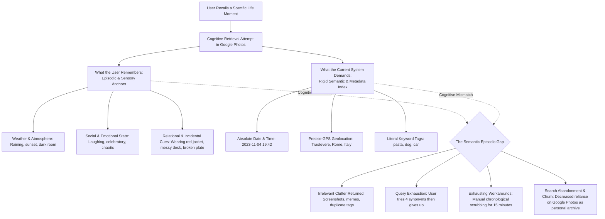
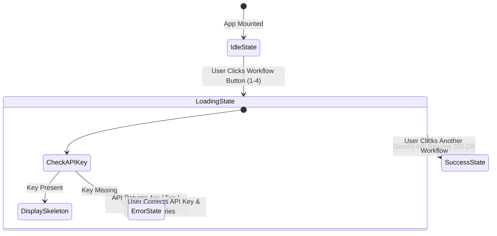

# Master Problem Statement: AI-Powered Discovery Engine for Google Photos (Internal PM Intelligence Tool)

---

## 1. Executive Summary & Strategic Context

**Target Product:** Google Photos (`com.google.android.apps.photos` / iOS / Web)  
**Target Users:** Google Photos Core Experience & Search Product Managers (PMs)  
**Domain:** Computational Photography, Semantic Image Retrieval & Personal Knowledge Management (PKM)  
**Core Strategic Objective:** Ingest, process, and synthesize unstructured public user feedback across external channels (Reddit, Google Play Store, Apple App Store, Google Support Forums) to extract behavioral heuristics regarding **human memory retrieval failures** and transform qualitative complaints into actionable product opportunities.

### The Problem in Numbers & Human Reality
Google Photos hosts over **4 trillion photos and videos**, with **28 billion new memories uploaded every week** by more than **1 billion monthly active users (MAU)**. However, as personal libraries swell past tens of thousands of items per account, **photo retrieval is experiencing catastrophic cognitive breakdown**:

1. **The Metadata Paradox**: Traditional photo indexing relies on objective metadata—timestamps, reverse-geocoded GPS coordinates, object detection tags (`dog`, `beach`, `car`), and facial clusters.
2. **The Human Episodic Reality**: Humans do not recall life events via absolute coordinates or discrete object labels. Human memory is **episodic, associative, sensory, and affective** (*"It was raining, I wore my red vintage jacket, and we ate that creamy truffle pasta after getting lost"*).
3. **The Search Failure Trap**: When users query Google Photos with natural semantic keywords (e.g., `"pasta"`), the system floods the screen with recipe screenshots, Pinterest downloads, or generic food pictures instead of the specific personal moment sought. 
4. **Abandonment & Frustration**: After 3–5 failed keyword iterations, users resort to grueling manual chronological scrolling or abandon the retrieval task entirely, degrading long-term product trust.

### Primary Purpose of the Internal PM Tool
Rather than treating user feedback as generic sentiment scores (e.g., *"Search rating: 2.8/5"*), this internal PM tool acts as a **deterministic, structured RAG (Retrieval-Augmented Generation) intelligence engine**. It enables Product Managers to unpack the deep cognitive architecture behind failed searches, pinpoint manual workarounds, and formulate engineering hypotheses for next-generation multi-modal Gemini retrieval models.

> [!IMPORTANT]
> **DETERMINISTIC PIPELINE CONTRACT — NOT A CHATBOT**  
> The final tool is explicitly **NOT a conversational chatbot**. It must function as a high-fidelity internal data processing dashboard where clicking dedicated analytical workflow triggers executes structured multi-shot prompts against raw user corpora to yield reproducible, consultant-grade PM deliverables.

---

## 2. Core Problem Decomposition & The Semantic-Episodic Gap

The root cause of search failure in Google Photos is the fundamental divergence between **Computer Vision Indexing Demands** and **Human Episodic Memory Retrieval Cues**:



### 2.1 The Two Divergent Models: System Demands vs. Human Memory

| Dimension | System Demands (Current Indexing Model) | Human Cognitive Anchor (Actual User Recall) |
|---|---|---|
| **Temporal Framing** | Exact calendar date, month, or range (`2021-04-12`) | Relative life phase (*"Sophomore year of college"*, *"right before we moved apartments"*) |
| **Spatial Framing** | Exact GPS coordinates or City/Country label | Spatial context (*"Under the bridge"*, *"that dimly lit corner cafe"*, *"on my messy desk"*) |
| **Visual Elements** | Isolated object bounding boxes (`dog`, `bicycle`, `cake`) | Scene composition & affective state (*"My dog sleeping looking exhausted"*, *"friends laughing uncontrollably"*) |
| **Incidental Context** | Ignored or filtered as background noise | Primary retrieval hook (*"I was wearing my bright yellow raincoat"*, *"the table was littered with receipts"*) |
| **Asset Differentiation** | Treats screenshots, camera captures, and downloads identically | Distinct mental silos (*"A photo I took"* vs. *"A screenshot I saved for 10 minutes"* ) |

---

## 3. Business & Product Metrics Framework

To measure retrieval success and quantify the business impact of closing the episodic search gap, Google Photos Core PMs track the following metrics:

### 3.1 North Star Metric
$$\mathbf{\text{Successful Memory Retrieval Rate (SMRR)}} = \frac{\text{Sessions where User Views/Shares/Enlarges Target Photo within } \le 45\text{s of Search Initiated}}{\text{Total Search-Initiated Sessions}} \times 100$$

### 3.2 Primary Funnel & Operational Metrics
1. **Search Failure Rate (SFR)**: Percentage of search sessions where the user triggers $\ge 3$ consecutive queries without opening a photo in full screen.
2. **Search Abandonment Rate (SAR)**: Percentage of search sessions terminated without a single photo interaction (exit app or navigate back to main grid).
3. **Time-to-Retrieve (TTR)**: Median elapsed seconds between entering the initial search query and expanding the target asset.
4. **Chronological Scrubbing Trigger Ratio**: Percentage of search sessions followed within 10 seconds by aggressive manual timeline scrolling ($\ge 500$ viewport pixels scrubbed).
5. **Screenshot Clutter Interference Index**: Ratio of synthetic/incidental screenshots returned in top 20 search results for personal memory queries.

---

## 4. The 4 Analytical Workflows (LLM Directives & Prompts)

The internal PM tool provides 4 standardized, deterministic analytical workflows triggered via dedicated UI buttons. Each workflow executes a purpose-built system prompt against the ingested unstructured user corpus using **Google Gemini 1.5 (Pro/Flash)** configured at `Temperature: 0.2` and `Top_P: 0.8`.

```mermaid
flowchart LR
    Dataset[(Simulated Unstructured<br/>User Feedback Corpus)] --> Engine[Gemini 1.5 Analytical Engine<br/>Temp: 0.2 | Top_P: 0.8]
    
    Engine --> W1[Workflow 1:<br/>Taxonomy of 'Lost' Photos]
    Engine --> W2[Workflow 2:<br/>Cognitive Gap Matrix]
    Engine --> W3[Workflow 3:<br/>Behavioral Workaround Mapping]
    Engine --> W4[Workflow 4:<br/>Product Opportunity Synthesis]
    
    W1 --> D1[H3 Categories + Blockquote Quotes]
    W2 --> D2[Comparative Markdown T-Chart Table]
    W3 --> D3[Numbered Workarounds + Friction Scores]
    W4 --> D4[Structured PM Deliverable: Problem/Solution/Hypothesis]
```

---

### 4.1 Workflow 1: Taxonomy of "Lost" Photos

- **Strategic Goal:** Categorize what types of personal photos users struggle to retrieve using keyword search. Move beyond generic themes (e.g., *"vacations"*, *"birthdays"*) to uncover high-friction edge-cases (e.g., incidental screenshots, aesthetic moments, relative-temporal photos).
- **LLM System Prompt:**
  ```text
  Act as a Principal PM. Analyze the dataset. Identify 3 distinct categories of photos users struggle to retrieve. Exclude generic categories (e.g., 'vacation'). Focus on edge-cases like 'Incidental Screenshots' or 'Vibe/Aesthetic Photos'. For each category, provide a definition and a direct quote from the data as evidence.
  ```
- **Strict Output Format Requirements:**
  - Strict Markdown formatting.
  - Category titles formatted as `### [Category Name]`.
  - Bullet points (`-`) for the formal analytical definition.
  - Blockquotes (`>`) for the verbatim user evidence extracted directly from the dataset.

#### Expected Output Demonstrator:
```markdown
### 1. Incidental & Ephemeral Screenshots
- **Definition**: Utilitarian captures (parking stall numbers, receipts, recipe snippets, wifi passwords) that lack rich emotional semantic context and pollute search queries for genuine life events.
- **Evidence**:
> "I'm trying to find a photo of a specific pasta dish from my Rome trip. Searching 'pasta' gives me screenshots of recipes. I gave up after scrolling for 10 minutes."

### 2. Situational & Affective Moments ("Vibe Photos")
- **Definition**: Images whose defining characteristic is an ambient mood, sensory cue, or aesthetic state rather than an indexed foreground object.
- **Evidence**:
> "I try searching for my dog, but it shows every dog photo instead of the specific one where he's sleeping on my messy desk."

### 3. Contextually-Anchored Artifacts
- **Definition**: Physical objects or documents captured within casual settings where traditional OCR or label detection matches the broad subject but misses personal ownership markers.
- **Evidence**:
> "Looking for the serial number sticker on the back of my router taken last summer. Search returns every electronic gadget photo in my cloud."
```

---

### 4.2 Workflow 2: Cognitive Gap Matrix (Remembered vs. Forgotten)

- **Strategic Goal:** Deconstruct the user's mental model and memory state during a failed retrieval episode. Identify what episodic/sensory cues users retain in their working memory versus what rigid metadata parameters the current system demands.
- **LLM System Prompt:**
  ```text
  Analyze the dataset to map the cognitive gap during a failed search. What sensory, relational, or episodic information do users consistently retain (e.g., weather, people)? What absolute metadata do they consistently forget (e.g., dates, locations)? Generate a comparative analysis.
  ```
- **Strict Output Format Requirements:**
  - Formatted as a **Markdown Table (T-Chart)**.
  - Column 1: `Retained Episodic Anchors (Human Recall)`
  - Column 2: `Forgotten System Demands (Current Index Requirements)`
  - Column 3: `Failure Mode / Search Breakdown`

#### Expected Output Demonstrator:
| Retained Episodic Anchors (Human Recall) | Forgotten System Demands (Current Index Requirements) | Failure Mode / Search Breakdown |
|---|---|---|
| **Atmospheric & Weather Cues** (*"It was pouring rain in Rome"*) | Exact calendar date/month (`2023-11-04`) | System cannot filter generic food photos by meteorological context of capture. |
| **Subject Posture & Ambient State** (*"Sleeping on my messy desk"*) | Generic object classification tag (`dog`, `desk`) | System returns 400+ generic dog photos; lacks nuance to filter for sleep posture and environmental clutter. |
| **Relational Wardrobe & Incidental Accents** (*"Wearing a red vintage jacket"*) | Geolocation metadata tag (`Rome, Italy`) | User unable to filter food search by companion/user clothing color and texture. |
| **Relative Chronology** (*"Right after my sister graduated"*) | Absolute timestamp (`14:22:01 GMT+1`) | Absence of personal episodic event linking forces exhaustive chronological scrubbing. |

---

### 4.3 Workflow 3: Behavioral Workaround Mapping

- **Strategic Goal:** Document the exhausting manual behaviors, UI brute-forcing, and compensatory habits users endure when search fails. Quantify customer friction to prioritize feature development.
- **LLM System Prompt:**
  ```text
  Identify the specific manual actions users take to brute-force the UI when their search fails. Name each behavior (e.g., 'The Person Pivot', 'Chronological Scrubbing'). Assign a 'Friction Score' (High/Medium/Low) to each based on user frustration.
  ```
- **Strict Output Format Requirements:**
  - Numbered list (`1.`, `2.`, `3.`).
  - **Bolded workaround nomenclature**.
  - Explicit tag: **Friction Score: [High / Medium / Low]**.
  - Detailed definition explaining user actions, cognitive tax, and time loss.

#### Expected Output Demonstrator:
```markdown
1. **Chronological Scrubbing**
   - **Friction Score**: **High**
   - **Definition**: The brute-force action where a user abandons search and vigorously scrubs the main photo timeline for 5–15 minutes, scanning thousands of thumbnails based on estimated season or year, causing significant cognitive fatigue and eye strain.

2. **The Person Pivot**
   - **Friction Score**: **Medium**
   - **Definition**: When keyword search for an event fails, users navigate to the 'People & Pets' album, filter by a known companion who was present, and manually scroll through all shared photos with that individual to locate the target shot.

3. **External App Trail (Social Audit)**
   - **Friction Score**: **High**
   - **Definition**: Exiting Google Photos to cross-reference WhatsApp chat history, Instagram stories, or credit card bank statements to verify the exact calendar date of an outing before returning to Google Photos to input the date filter.

4. **Multi-Keyword Permutation Roulette**
   - **Friction Score**: **Medium**
   - **Definition**: Rapidly inputting increasingly desperate synonyms, misspelled tags, or hyper-specific phrases (e.g., 'dog bed', 'dog desk', 'dog sleeping', 'puppy brown') hoping one triggers a lucky computer vision cluster.
```

---

### 4.4 Workflow 4: Product Opportunity Synthesis (The PM Deliverable)

- **Strategic Goal:** Translate identified behavioral gaps, failure taxonomies, and user workarounds into two concrete, high-impact **Product Opportunity Areas (POAs)** that Google Photos PMs can champion into roadmap OKRs.
- **LLM System Prompt:**
  ```text
  Based on the identified gaps and workarounds, generate 2 distinct Product Opportunity Areas (POAs). For each POA, define the 'Problem Space', the 'Proposed AI Solution', and a 'Hypothesis to Test'. Following the 2 POAs, generate a 'Comparison / Trade-off Matrix' table comparing POA 1 vs POA 2 based on: (1) Specific Retrieval Problems Solved, (2) User Impact (High/Medium/Low + rationale), and (3) Implementation Effort (High/Medium/Low + rationale).
  ```
- **Strict Output Format Requirements:**
  - Structured Markdown sections for each POA (`## POA 1: [Name]`, `## POA 2: [Name]`).
  - Strict sub-headers:
    - `### Problem Space`
    - `### Proposed AI Solution`
    - `### Hypothesis to Test`
  - Following POA 2, an H2 header `## Comparison / Trade-off Matrix` containing a Markdown Table with columns:
    `| Evaluation Dimension | POA 1: [Short Title] | POA 2: [Short Title] |`

#### Expected Output Demonstrator:
```markdown
## POA 1: Multi-Modal Episodic Query Resolver ("Natural Recall Search")

### Problem Space
Users recall personal photos through sensory, atmospheric, and incidental anchors (e.g., weather, apparel color, emotional posture), but Google Photos queries default to strict isolated object tags, returning irrelevant clutter like screenshots and generic duplicates.

### Proposed AI Solution
Integrate Gemini 1.5 Multi-Modal Vector Embeddings directly into the search index. Enable composite episodic queries like *"me wearing red jacket eating pasta in the rain"* by cross-attending visual clothing colors, ambient weather conditions, and foreground dishes, while dynamically suppressing screenshots and receipts.

### Hypothesis to Test
If users can formulate multi-anchor episodic queries combining $\ge 2$ sensory attributes, then Search Failure Rate (SFR) will decrease by 35% and Time-to-Retrieve (TTR) for non-dated event photos will drop from 180 seconds to under 25 seconds.

---

## POA 2: Contextual Visual Scrubber & Posture-Aware Animal Clustering

### Problem Space
Pet owners seeking specific poses or contexts (e.g., *"dog sleeping on my desk"*) are inundated with hundreds of indistinguishable portraits, forcing them into exhausting manual chronological scrubbing.

### Proposed AI Solution
Introduce contextual facet pills below the search bar for high-volume entities. When searching *"dog"*, the engine automatically presents contextual sub-filters powered by zero-shot classification: `[Sleeping]`, `[On Furniture/Desk]`, `[Outdoors]`, `[With People]`, and `[Video Clips]`.

### Hypothesis to Test
Surfacing contextual posture and setting facets for high-density pet and people clusters will reduce Chronological Scrubbing instances by 50% and elevate photo sharing/export actions by 20%.

---

## Comparison / Trade-off Matrix

| Evaluation Dimension | POA 1: Multi-Modal Episodic Search | POA 2: Contextual Posture & Setting Facets |
|---|---|---|
| **Specific Retrieval Problems Solved** | Sensory, atmospheric, and wardrobe recall failures; screenshot and receipt clutter suppression | Entity clutter and pose ambiguity (pets, objects, people) requiring exhaustive chronological scrubbing |
| **User Impact** | **High** — Resolves primary drop-off point for high-emotion memories across the entire 1B+ user base | **Medium-High** — Greatly streamlines high-frequency queries (pets, kids) with tangible immediate utility |
| **Implementation Effort** | **High** — Requires fine-tuning multi-modal embeddings and vector index re-architecture | **Medium** — Leverages existing classification heads with lightweight front-end facet pill injection |
| **Strategic Recommendation** | Recommended for Core Search long-term architecture (Next-gen Gemini model rollout) | Recommended for immediate Q3/Q4 quick-win feature release on mobile clients |
```

---

## 5. Ingestion Data Schema & Simulated User Corpus

The engine processes a simulated dataset representing real public VoC feedback from Reddit, App Store, Play Store, and Google Support Forums.

### 5.1 JSON Data Schema Definition
Each record in the ingested array conforms to the following schema:

```typescript
interface UserFeedbackRecord {
  id: string;
  source: "r/GooglePhotos" | "Play Store" | "App Store" | "Google Support Forum";
  type: "Reddit Post" | "1-Star Review" | "2-Star Review" | "Support Thread" | "Feature Request";
  content: string;
  metadata: {
    upvotes?: number;
    rating?: number;
    device?: string;
    date: string;
    tags?: string[];
  };
}
```

### 5.2 Pre-Loaded Simulated Corpus Sample

```json
[
  {
    "id": "rec-001",
    "source": "r/GooglePhotos",
    "type": "Reddit Post",
    "content": "I'm trying to find a photo of a specific pasta dish from my Rome trip. Searching 'pasta' gives me screenshots of recipes. I can't remember the exact date, I just know it was raining and I was wearing a red jacket. I gave up after scrolling for 10 minutes.",
    "metadata": {"upvotes": 45, "date": "2023-11-04", "tags": ["search_failure", "screenshots", "travel"]}
  },
  {
    "id": "rec-002",
    "source": "Play Store",
    "type": "1-Star Review",
    "content": "Search is useless now. If I don't know the exact date, I can't find anything. I try searching for my dog, but it shows every dog photo instead of the specific one where he's sleeping on my messy desk.",
    "metadata": {"rating": 1, "device": "Pixel 7", "date": "2024-01-15", "tags": ["pets", "context_clutter"]}
  },
  {
    "id": "rec-003",
    "source": "Google Support Forum",
    "type": "Support Thread",
    "content": "How do I filter OUT screenshots when searching for tickets or receipts? Every time I search 'concert', I get 200 screenshots of Spotify playlists and ticket confirmations rather than the photos of me and my friends at the venue.",
    "metadata": {"upvotes": 112, "date": "2023-09-28", "tags": ["screenshot_pollution", "concert"]}
  },
  {
    "id": "rec-004",
    "source": "r/GooglePhotos",
    "type": "Reddit Post",
    "content": "Had to find a picture of my car's tire pressure sticker taken last year. Searched 'tire' and 'car' and got 500 pictures of road trips. I ended up opening WhatsApp to find the date I texted it to my mechanic, then scrolled to that date in Google Photos.",
    "metadata": {"upvotes": 88, "date": "2024-02-10", "tags": ["workaround", "external_app_audit"]}
  },
  {
    "id": "rec-005",
    "source": "App Store",
    "type": "2-Star Review",
    "content": "I remember the vibe of a photo—it was a sunset where everything had a purple haze on the beach in Greece. Searching 'sunset beach' returns 1,200 photos from the last 8 years. Why can't I search 'purple sunset with two people'?",
    "metadata": {"rating": 2, "device": "iPhone 15 Pro", "date": "2024-03-02", "tags": ["aesthetic_vibe", "sensory_recall"]}
  }
]
```

---

## 6. System Architecture & Technical Specifications

```mermaid
flowchart TB
    subgraph Client [Desktop UI Dashboard - React + Tailwind]
        Config[API Key Configuration & State]
        Toggles[Data Source Filter Toggles]
        Buttons[4 Workflow Action Buttons]
        Canvas[Main Reading Pane / Markdown Renderer]
        Export[Copy to Clipboard Action]
    end
    
    subgraph LocalPipeline [Client-Side Ingestion & Orchestration]
        DatasetStore[In-Memory VoC Corpus]
        PromptBuilder[Multi-Shot Structured Prompt Assembler]
    end
    
    subgraph GeminiBackend [Google Gemini API]
        ModelPro[Gemini 1.5 Flash / Pro]
    end
    
    Config --> PromptBuilder
    Toggles --> PromptBuilder
    Buttons -->|Trigger Workflow 1-4| PromptBuilder
    DatasetStore --> PromptBuilder
    
    PromptBuilder -->|POST Payload (Prompt + Corpus)| ModelPro
    ModelPro -->|Structured Markdown Stream / Response| Canvas
    Canvas --> Export
```

### 6.1 LLM Backend Parameters
- **Model:** `gemini-1.5-flash` (or `gemini-1.5-pro` for deeper analytical synthesis).
- **Temperature:** `0.2` (Strict, analytical, non-creative, fact-grounded in corpus).
- **Top_P:** `0.8`.
- **Top_K:** `40`.
- **Safety Settings:** Standard enterprise filters for internal Google tooling.

### 6.2 Frontend Architecture
- **Framework:** React / Next.js or modern clean HTML/JS.
- **Styling:** Tailwind CSS or Vanilla CSS adhering strictly to **Google Material / Internal Google Tool Design System** (Inter/Roboto typography, `#1a73e8` Google Blue accents, crisp slate borders, neutral white `#ffffff` canvas).

---

## 7. UI/UX Dashboard Layout & State Management Specifications

The user interface is engineered as a **desktop-first internal operational tool** featuring a 30/70 split:

```
+---------------------------------------------------------------------------------------------------------+
| [G] Google Photos VoC Intelligence Engine           [Core PM Tool]           [Model: Gemini 1.5 Flash] |
+------------------------------------+--------------------------------------------------------------------+
| LEFT SIDEBAR (30% Width)           | MAIN CANVAS (70% Width)                                            |
|                                    |                                                                    |
| [⚙️ API Configuration]              | [Reading Pane / Report Output]                                     |
| Enter Gemini API Key: [••••••••••] |                                                                    |
| Status: ● Connected                | (Idle State Graphic / Loading Skeleton / Rendered Report)          |
|                                    |                                                                    |
| [📂 Active Data Sources]           |                                                                    |
| [x] r/GooglePhotos (Reddit)        |                                                                    |
| [x] Play Store Reviews             |                                                                    |
| [x] Apple App Store                |                                                                    |
| [x] Google Support Community       |                                                                    |
|                                    |                                                                    |
| [⚡ Analytical Workflows]          |                                                                    |
| [Button 1: Taxonomy of Lost Photos]|                                                                    |
| [Button 2: Cognitive Gap Matrix]   |                                                                    |
| [Button 3: Behavioral Workarounds] |                                                                    |
| [Button 4: Product Opportunity POAs|                                                                    |
|                                    |                                                                    |
| Corpus Size: 5 Records Loaded      | [📋 Copy to Clipboard]     [📥 Export Markdown]                    |
+------------------------------------+--------------------------------------------------------------------+
```

### 7.1 Critical UI State Machine



1. **Idle State:**
   - Displays a clean Google-styled empty state with the Google Photos lens/pinwheel aesthetic.
   - Informative subtitle: *"Select an analytical workflow from the left sidebar to synthesize user search failure patterns."*
2. **Loading State:**
   - Shimmering skeleton cards imitating markdown headers, table rows, and blockquotes.
   - Dynamic status indicator: *"Synthesizing unstructured user data with Gemini 1.5..."* / *"Extracting cognitive retrieval heuristics..."*
3. **Error State:**
   - Crisp red toast notification or inline alert box with high visual salience.
   - Clear diagnostic message: *"Gemini API Key missing or invalid. Please configure your API key in the sidebar."*
4. **Success State:**
   - Renders formatted Markdown using high-legibility typography (`Inter` or `Roboto`), ample line height (`1.65`), distinct gray blockquote borders (`border-l-4 border-blue-500 bg-slate-50`), and zebra-striped tables.
5. **Export Surface:**
   - Prominent **"Copy to Clipboard"** button with instantaneous checkmark feedback (*"Copied to clipboard!"*) enabling effortless pasting into Google Slides or Docs.

---

## 8. Builder Success Criteria & Quality Checklist

To ensure the build meets the high standards required of an internal Google product management tool, verify against this checklist:

- [x] **Zero Chatbot Artifacts**: No freeform conversational chat bubbles, user typing prompts, or generic conversational greetings (*"Hello! How can I help you today?"*).
- [x] **Deterministic Pipeline**: Clicking each of the 4 buttons executes an exact multi-shot prompt against the dataset, producing consistent, structured reports.
- [x] **Strict Formatting Adherence**:
  - Workflow 1 strictly outputs `###` headers and `>` blockquotes.
  - Workflow 2 strictly outputs a markdown T-chart table.
  - Workflow 3 strictly outputs a numbered list with bold names and friction scores.
  - Workflow 4 strictly outputs 2 POAs with Problem, Solution, and Hypothesis sub-headers.
- [x] **API Key Security**: Input field masked with password toggling; key kept in memory/local session only.
- [x] **Executive Typography**: Google Material aesthetic, responsive reading pane, clean typography, and export actions.
